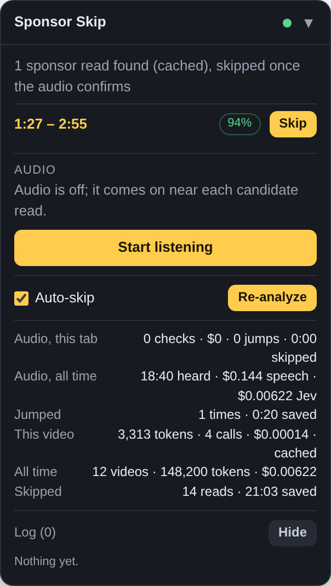
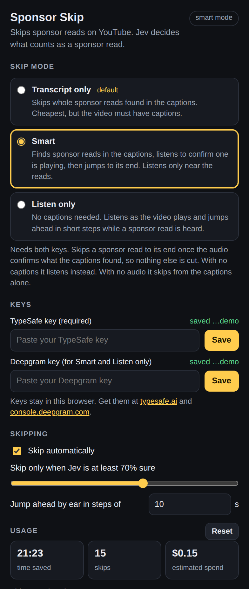

# Sponsor Skip

Skips sponsor reads on YouTube. A Chrome extension finds each read with
**Jev** (TypeSafe's System One model) and jumps past it while you watch; a
small web app does the same for a pasted link. Code owns every timestamp: Jev
only ever names a transcript line or answers yes/no about what it heard.

You need a [TypeSafe](https://typesafe.ai) API key. Smart and Listen modes
also need a [Deepgram](https://console.deepgram.com) key for speech-to-text.

## Chrome extension

1. Clone this repo. Open `chrome://extensions`, turn on **Developer mode**,
   click **Load unpacked** and pick the `extension/` folder.
2. Click the extension's icon and paste your TypeSafe key. Transcript mode
   works from there; add a Deepgram key to try the Smart or Listen modes.
3. Open any YouTube video. A panel appears bottom-right with the reads found,
   a **Skip** button per read, the auto-skip toggle, the running cost and, in
   the audio modes, what is being heard and a log of every decision.

<p align="center"></p>

### Modes

| Mode | How it works | Needs | Cost per hour watched |
| --- | --- | --- | --- |
| **Transcript only** (default) | Jev reads the captions and the whole read is skipped. Works only where YouTube hands the transcript over. | TypeSafe | under a cent |
| **Smart** | The transcript finds each read and its end; the audio is listened to only around each read, and once Jev agrees a read is playing the video jumps to its end. If the audio has not confirmed a read 12 s after its start, the transcript skips it anyway. | Both keys | about $0.05 |
| **Listen only** | No transcript. The video's audio is streamed to Deepgram as it plays; when Jev hears a read, the video jumps ahead in 10 s steps until it is over. | Both keys | about $0.46 |

When in doubt the extension watches a second of the read rather than cutting
a second of content: a skip only happens above the confidence you set (70%
by default), and in the audio modes everything Jev hears has already played,
so a jump never lands before the read starts.

In the audio modes listening starts by itself when a video plays and stops
shortly after it pauses; **Stop** in the panel turns it off for the current
video. Audio is captured from the video element itself, so no extra browser
permission is needed and playback is untouched.

The popup holds the mode, the keys, the skipping settings (auto-skip, the
confidence needed, the step for jumps by ear) and the usage totals, with the
model and prices under *Advanced*. Keys stay in `chrome.storage.local` and
never reach the page. Results are cached per video; **Re-analyze** in the
panel forces a fresh run.

<p align="center"></p>

## Web app

Paste a link, get the timestamps and the transcript around the boundary.

```sh
npm install
cp .env.example .env      # put your TYPESAFE_API_KEY in it
npm start                 # http://localhost:3000
```

If YouTube has no transcript for the video, use **Paste a transcript instead**
(open the video, choose *Show transcript*, copy it in). To try the UI without
a key, run the stand-in API and click **Try it on the demo transcript**:

```sh
node test/mock-typesafe-api.js &
TYPESAFE_API_KEY=local TYPESAFE_BASE_URL=http://127.0.0.1:4010 npm start
```

<p align="center"></p>

## How Jev finds a read

Jev answers typed questions (a probability, or a choice with a distribution)
over some state; it does not generate text, and it reads numbers as text. So
the transcript is rendered as `L042| …` lines and Jev picks line IDs, which
code maps back to seconds (the
[semantic find cookbook](https://docs.typesafe.ai/cookbooks/semantic_find)
pattern). Long transcripts are scanned in 80-line windows to stay inside the
token budget and keep irrelevant text out of the state.

Every question carries the same definition of a sponsor segment: a
**lead-in** (the story or "quick break" that exists only to arrive at the
sponsor), the **pitch**, then the **offer**. Merch, memberships and "like and
subscribe" are spelled out as not sponsors. The pipeline in `src/jev.js`:

1. **Scan** every window in parallel: does a read begin here, and which line
   first names the sponsor?
2. **Anchor** around the winner: confirm it, and find the last line.
3. **Trace back** from the naming line to the first line of the lead-in.
4. **Repeat** with that segment removed until no window looks like it has one
   (at most six reads).

A skip is cut at a phrase inside the boundary line, and only at a phrase Jev
is at least 80% sure is sponsor. Run the pipeline on a real video with
`npm run analyze -- <youtube url>` (`--verbose` shows every window).

In the audio modes Jev is asked, every few seconds, over the last minute of
what was heard whether the speaker is inside a read *right now*. After a
jump it is asked again with the lines from before and after the jump side by
side, and the video steps on while the answer stays yes. The trade for never
cutting early is that the first seconds of every read are heard. The decision
loop is `src/live.js`; the speech socket lives in `extension/offscreen.js`,
where another provider can be added next to Deepgram.

## Accuracy against SponsorBlock

[SponsorBlock](https://sponsor.ajay.app)'s community labels are the ground
truth. Transcripts must be fetched from a home connection (YouTube blocks
datacenter IPs), so they are saved once and committed.

```sh
npm run sample        # pick ~20 labelled videos from a mirror -> eval/videos.json
npm run transcripts   # save their transcripts to eval/transcripts/ (home connection)
npm run eval          # run the pipeline on each, score against the labels
```

`eval` prints labelled and predicted segments side by side, recall,
precision, median start and end error, how many boundaries cut into content,
and the token cost. Results are cached in `eval/cache/`; pass `--fresh` after
changing the questions.

## Development

```sh
npm test              # unit tests against a stub Jev client
npm run build:ext     # copy src/ into extension/lib/ (npm test fails if it drifts)
npm run test:ext      # extension end-to-end in headless Chromium, no network needed
npm run screenshots   # regenerate docs/popup.png and docs/panel.png the same way
```

`test:ext` and `screenshots` need Playwright's Chromium
(`npx playwright install chromium`, or `CHROME=/path/to/chrome`).

```
extension/       Chrome extension (MV3): background worker, content script + panel, popup,
                 offscreen.js (speech socket), pcm-worklet.js (audio capture); lib/ mirrors src/
src/jev.js       the questions and the transcript pipeline
src/live.js      the audio-mode decision loop
src/transcript.js  cues -> labelled lines, windowing
src/youtube.js   link parsing, transcript fetch (youtubei.js), pasted-transcript parser
server.js, public/   the web app
scripts/         analyze, eval, sample, save-transcripts, screenshots
eval/            sampled videos, saved transcripts, cached runs
test/            node --test suite, stub client, mock API, extension e2e
```

## Known limits

- Transcript fetching uses YouTube's private InnerTube API through
  `youtubei.js`; it can break when YouTube changes things, and the caption
  tracks are hidden from cloud IPs. The audio modes do not depend on it.
- The audio modes listen to one tab at a time, and the content script only
  runs on youtube.com for now.
- The last jump in Listen mode can overshoot into content by up to one step.
- Deepgram bills per minute heard: Listen mode streams the whole video, Smart
  mode only the minutes around each read.
