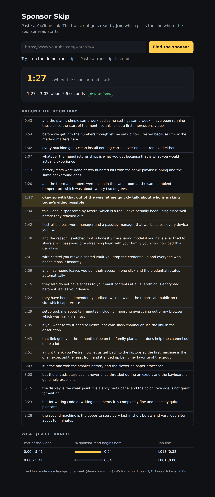
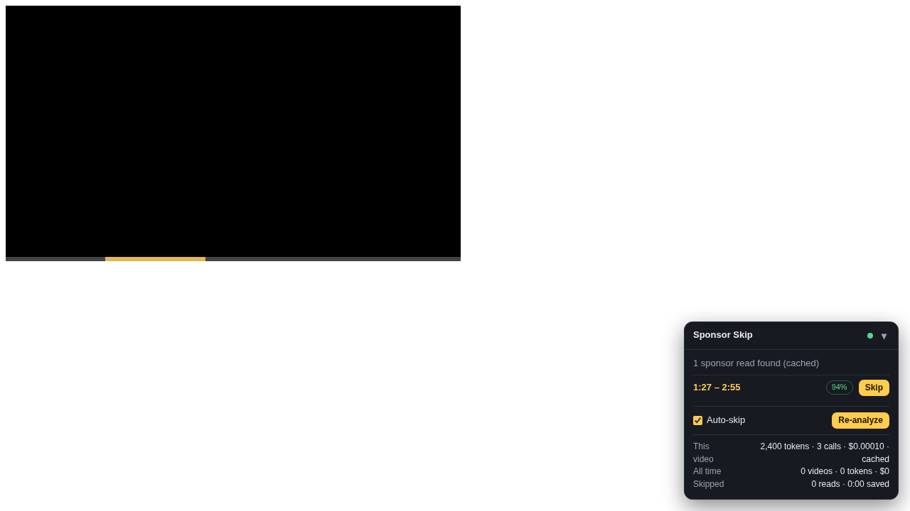

# Sponsor Skip

Paste a YouTube link, get the timestamps of the sponsor reads. Or install the
Chrome extension and have them skipped while you watch.

The transcript is fetched from YouTube, split into short labelled lines, and
**Jev** (TypeSafe's System One model) picks the line where the sponsor read
begins. Code owns the timestamps; Jev only ever names a line.



## Run it

You need Node 20+ and a TypeSafe API key.

```sh
npm install
cp .env.example .env      # put your TYPESAFE_API_KEY in here
npm start                 # http://localhost:3000
```

Paste a link and press **Find the sponsor**. If YouTube has no transcript for
the video (captions off, or a fetch hiccup), use **Paste a transcript instead**:
open the video on YouTube, choose *Show transcript*, copy it in. Timestamps are
kept when they are included.

### Without a key

To look at the UI without a key, run a local stand-in for the TypeSafe API. It
answers with keyword spotting, so it only proves the plumbing, not the model.

```sh
node test/mock-typesafe-api.js &
TYPESAFE_API_KEY=local TYPESAFE_BASE_URL=http://127.0.0.1:4010 npm start
```

Then click **Try it on the demo transcript**.

## Chrome extension

The `extension/` folder is a Manifest V3 extension that runs on YouTube watch
pages, finds the sponsor reads with Jev, marks them on the progress bar and
skips them automatically.

1. Open `chrome://extensions`, turn on **Developer mode**, click **Load
   unpacked**, and pick the `extension/` folder.
2. Click the extension's icon and paste your TypeSafe API key.
3. Open any YouTube video. A panel appears bottom-right with the segments,
   an auto-skip toggle, a skip button per read, and the stats.

The popup holds the settings (auto-skip on/off, the confidence a read needs
before it is skipped automatically, the model, and the price used for the cost
estimate) and the running totals: videos analysed, Jev requests, tokens, the
estimated cost, reads skipped and time saved. Results are cached per video, so
re-watching costs nothing; **Re-analyze** in the panel forces a fresh run.



The extension talks to TypeSafe directly from its background worker; the key
lives in `chrome.storage.local` on your machine and never reaches the page.
Captions come from YouTube's player data for the current video (with a
fallback to the watch page HTML), fetched as `json3` from within the page, so
there is no server to run. The pipeline is the same code as the web app:
`extension/lib/` is a copy of `src/`, refreshed with `npm run build:ext`
(`npm test` fails if the copy drifts).

`npm run test:ext` runs the extension in headless Chromium against a stand-in
youtube.com page (Playwright routes the requests), covering injection, caption
extraction, the panel, markers, auto-skip and the popup. It needs
`npx playwright install chromium` once.

## How the Jev call works

Jev answers typed questions (yes/no probabilities, choices with a probability
distribution) over some *state*; it does not generate text. Two things from the
docs shaped the design:

- Jev reads times and numbers as text, not as ordered quantities. So it is never
  asked for a timestamp. The transcript is rendered as `L042| …` lines, Jev picks
  an ID, and code maps that back to seconds. This is the pattern from the
  [semantic find cookbook](https://docs.typesafe.ai/cookbooks/semantic_find).
- State and questions share a 32k / 64k token budget, and accuracy drops with
  irrelevant material in the state. So long transcripts are scanned in windows
  of 80 lines (roughly ten minutes each) rather than in one go.

The pipeline is in `src/jev.js` and runs in two stages:

1. **Scan.** One request per window, all in parallel. Each asks two independent
   questions over the same excerpt: a *noul* (“does a paid sponsor read begin in
   this excerpt?”) and a *choice* over that window's line IDs plus a `none`
   option (“which line is the first line of the sponsor read?”). The window with
   the highest noul wins; below 0.35 the answer is “no sponsor read”.
2. **Refine.** One request over the ~40 lines around the winning line, asking
   for the exact first line, the last line (with a “continues past this
   excerpt” option), and a confirming noul. The refine pass sees the whole
   segment, so its presence probability caps the reported confidence.
3. **Repeat.** Videos often carry more than one read, sometimes two in the
   same window. The confirmed segment's lines are removed from its window,
   that window is scanned again, and the loop continues until no window looks
   like it still has a read starting in it (capped at six segments).

Confidence bands follow the cookbook (0.7 = found, 0.35 = maybe); tune them on
real videos. The UI shows every window's probability under *What Jev returned*.

## Layout

```
extension/           Chrome extension (MV3); lib/ is a copy of src/
server.js            Express server; keeps the API key server-side
src/youtube.js       link parsing, transcript fetch (youtubei.js), pasted-transcript parser
src/transcript.js    cues -> labelled lines, windowing, timestamp formatting
src/jev.js           the questions and the two-stage pipeline
public/              the page
fixtures/            a synthetic transcript with a sponsor read at 1:27
test/                node --test suite, a stub client, and the mock API server
```

`npm test` runs the suite against the stub client.

## Known limits

- Transcript fetching uses `youtubei.js`, which talks to YouTube's private
  InnerTube API. It works without any YouTube key but can break when YouTube
  changes things; the paste box is the fallback.
- Boundaries are line-granular (lines are about 7 seconds), so a skip lands
  within a few seconds of the real cut.
